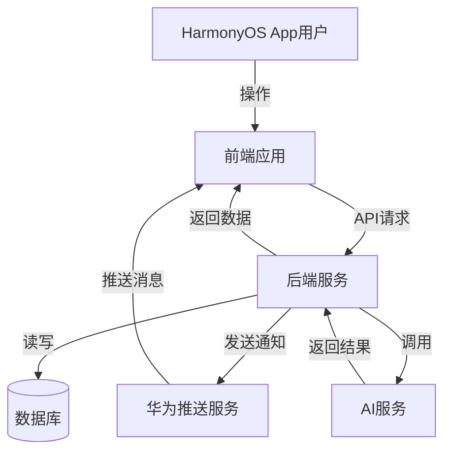

# 青序项目需求分析文档

## 1. 项目背景

### 1.1 项目概述
青序 (QinXu) 是一款基于 HarmonyOS 原生开发的智慧校园服务应用，旨在为学生提供一站式的校园信息服务平台。通过 Node.js 后端中间层，实现与教务系统的数据交互，为学生提供课表查询、成绩查询、考试安排、培养计划、学分进度等核心功能，并集成 AI 学习伙伴、空教室查询、电费查询等扩展功能。

### 1.2 开发目标
- **提供便捷的校园信息服务**：整合教务系统数据，实现一站式信息获取
- **提升用户体验**：现代化 UI 设计，流畅的交互体验
- **增强学习辅助**：集成 AI 功能，提供个性化学习支持
- **保障数据安全**：采用加密传输和存储，保护学生隐私
- **支持实时通知**：通过推送服务，及时获取重要信息

### 1.3 技术环境
- **前端**：HarmonyOS (API 9+), ArkTS, ArkUI
- **后端**：Node.js, Express, Sequelize
- **数据库**：SQLite (开发环境), MySQL (生产环境)
- **安全**：AES-256-CBC 加密
- **推送**：华为 Push Kit
- **AI**：多模型支持 (MiniMax, Qwen, DeepSeek)

## 2. 功能需求

### 2.1 核心功能模块

#### 2.1.1 用户认证模块
- **功能描述**：实现学生登录认证，支持账号密码登录，记住密码和自动登录功能
- **输入**：学号、密码
- **输出**：登录状态、用户信息
- **流程**：
  1. 用户输入学号密码
  2. 前端调用后端登录API
  3. 后端验证并返回认证状态
  4. 前端存储登录状态和用户信息

#### 2.1.2 课表查询模块
- **功能描述**：展示学生课程表，支持周视图、周次切换、课程详情查看
- **输入**：学期、周次
- **输出**：课程表数据、课程详情
- **流程**：
  1. 用户进入课表页面
  2. 前端请求课表数据
  3. 后端返回模拟课表数据
  4. 前端展示课程表

#### 2.1.3 成绩查询模块
- **功能描述**：查询学生成绩，支持学期分组、成绩详情查看、成绩分析
- **输入**：学期
- **输出**：成绩列表、成绩详情、绩点分析
- **流程**：
  1. 用户进入成绩页面
  2. 前端请求成绩数据
  3. 后端返回模拟成绩数据
  4. 前端展示成绩列表

#### 2.1.4 考试安排模块
- **功能描述**：查询考试安排，支持考试详情查看、考试提醒
- **输入**：学期
- **输出**：考试列表、考试详情
- **流程**：
  1. 用户进入考试页面
  2. 前端请求考试数据
  3. 后端返回模拟考试数据
  4. 前端展示考试安排

#### 2.1.5 培养计划模块
- **功能描述**：查看专业培养计划，支持课程分类展示、学分要求查看
- **输入**：专业、年级
- **输出**：培养计划课程列表、学分要求
- **流程**：
  1. 用户进入培养计划页面
  2. 前端请求培养计划数据
  3. 后端返回模拟培养计划数据
  4. 前端展示培养计划

#### 2.1.6 学分进度模块
- **功能描述**：展示学分完成情况，支持学分分类统计、进度可视化
- **输入**：专业、年级
- **输出**：学分统计、进度数据
- **流程**：
  1. 用户进入学分进度页面
  2. 前端请求学分进度数据
  3. 后端返回模拟学分进度数据
  4. 前端展示学分进度

#### 2.1.7 空教室查询模块
- **功能描述**：查询空闲教室，支持校区、楼栋、时间段筛选
- **输入**：校区、楼栋、时间段
- **输出**：空教室列表
- **流程**：
  1. 用户进入空教室页面
  2. 用户选择查询条件
  3. 前端请求空教室数据
  4. 后端返回模拟空教室数据
  5. 前端展示空教室列表

#### 2.1.8 电费查询模块
- **功能描述**：查询宿舍电费余额，支持电费提醒设置
- **输入**：宿舍信息、提醒阈值
- **输出**：电费余额、提醒设置状态
- **流程**：
  1. 用户进入电费页面
  2. 用户绑定宿舍信息
  3. 前端请求电费数据
  4. 后端返回模拟电费数据
  5. 前端展示电费信息

#### 2.1.9 公告通知模块
- **功能描述**：展示教务公告，支持公告详情查看
- **输入**：公告ID
- **输出**：公告列表、公告详情
- **流程**：
  1. 用户进入公告页面
  2. 前端请求公告数据
  3. 后端返回模拟公告数据
  4. 前端展示公告列表

#### 2.1.10 推送服务模块
- **功能描述**：接收推送通知，支持成绩发布、考试安排、电费提醒等通知
- **输入**：推送Token
- **输出**：通知消息
- **流程**：
  1. 前端注册推送Token
  2. 后端存储Token
  3. 后端发送推送消息
  4. 前端接收并展示通知

#### 2.1.11 AI学习伙伴模块
- **功能描述**：提供AI学习辅助，支持学习问题解答、学习计划制定、知识点总结
- **输入**：用户问题、学习数据
- **输出**：AI响应、学习计划、知识总结
- **流程**：
  1. 用户进入AI学习伙伴页面
  2. 用户输入问题
  3. 前端请求AI服务
  4. 后端调用AI模型
  5. 前端展示AI响应

### 2.2 辅助功能模块

#### 2.2.1 个人中心模块
- **功能描述**：管理个人信息、账号设置、隐私设置、主题设置
- **输入**：用户设置
- **输出**：设置状态
- **流程**：
  1. 用户进入个人中心
  2. 用户修改设置
  3. 前端保存设置
  4. 前端更新UI

#### 2.2.2 主题管理模块
- **功能描述**：支持浅色/深色主题切换，跟随系统主题
- **输入**：主题选择
- **输出**：主题状态
- **流程**：
  1. 用户进入主题设置
  2. 用户选择主题
  3. 前端应用主题
  4. 前端更新UI

#### 2.2.3 数据加密模块
- **功能描述**：加密存储敏感数据，保护用户隐私
- **输入**：敏感数据
- **输出**：加密数据
- **流程**：
  1. 前端获取敏感数据
  2. 前端加密数据
  3. 前端存储加密数据
  4. 前端解密数据（需要时）

## 3. 非功能需求

### 3.1 性能需求
- **响应时间**：API请求响应时间 < 2秒
- **页面加载**：首屏加载时间 < 3秒
- **内存使用**：应用内存占用 < 200MB
- **电池消耗**：正常使用下电池消耗 < 10%/小时

### 3.2 安全需求
- **数据加密**：敏感数据采用AES-256-CBC加密
- **网络传输**：使用HTTPS加密传输
- **权限管理**：遵循HarmonyOS权限管理规范
- **数据存储**：本地存储采用安全存储机制

### 3.3 可用性需求
- **界面美观**：符合HarmonyOS设计规范，UI美观易用
- **操作流畅**：动画过渡流畅，无卡顿
- **响应及时**：用户操作反馈及时
- **错误处理**：完善的错误提示和异常处理

### 3.4 兼容性需求
- **设备兼容**：支持HarmonyOS 2.0及以上版本
- **屏幕适配**：适配不同屏幕尺寸的设备
- **网络适配**：支持不同网络环境（Wi-Fi、移动网络）

### 3.5 可维护性需求
- **代码规范**：遵循HarmonyOS和Node.js代码规范
- **文档完善**：提供完整的开发文档
- **测试覆盖**：核心功能测试覆盖率 > 80%

## 4. 数据需求

### 4.1 数据模型

#### 4.1.1 学生信息
| 字段 | 类型 | 说明 |
|------|------|------|
| studentId | string | 学号 |
| name | string | 姓名 |
| gender | string | 性别 |
| enrollmentYear | string | 入学年份 |
| className | string | 班级 |
| major | string | 专业 |
| college | string | 学院 |

#### 4.1.2 课程信息
| 字段 | 类型 | 说明 |
|------|------|------|
| name | string | 课程名称 |
| teacher | string | 教师 |
| location | string | 上课地点 |
| dayOfWeek | string | 星期几 |
| week | number | 周次 |
| period | string | 节次 |
| weeks | string | 上课周数 |
| courseType | string | 课程类型 |
| semester | string | 学期 |

#### 4.1.3 成绩信息
| 字段 | 类型 | 说明 |
|------|------|------|
| courseCode | string | 课程代码 |
| courseName | string | 课程名称 |
| score | string | 成绩 |
| credit | string | 学分 |
| gradePoint | string | 绩点 |
| courseType | string | 课程类型 |
| examType | string | 考试类型 |
| semester | string | 学期 |

#### 4.1.4 考试信息
| 字段 | 类型 | 说明 |
|------|------|------|
| courseName | string | 课程名称 |
| examTime | string | 考试时间 |
| location | string | 考试地点 |
| seatNumber | string | 座位号 |
| examType | string | 考试类型 |
| status | string | 考试状态 |

#### 4.1.5 培养计划
| 字段 | 类型 | 说明 |
|------|------|------|
| courseCode | string | 课程代码 |
| courseName | string | 课程名称 |
| credit | string | 学分 |
| totalHours | string | 总学时 |
| courseType | string | 课程类型 |
| courseAttribute | string | 课程属性 |
| examType | string | 考试类型 |
| semester | string | 学期 |

#### 4.1.6 学分进度
| 字段 | 类型 | 说明 |
|------|------|------|
| category | string | 学分类别 |
| requiredCredits | string | 要求学分 |
| completedCredits | string | 已修学分 |
| currentCredits | string | 当前学分 |
| remainingCredits | string | 剩余学分 |

### 4.2 数据存储
- **前端存储**：使用@kit.ArkData (Preferences) 存储用户设置和缓存数据
- **后端存储**：使用SQLite/MySQL存储用户信息和业务数据
- **数据同步**：前端通过API与后端同步数据
- **数据加密**：敏感数据采用AES-256-CBC加密存储

## 5. 技术架构

### 5.1 系统架构

### 5.2 前端架构
- **UI层**：ArkUI 声明式组件
- **业务层**：页面逻辑、状态管理
- **服务层**：API客户端、数据存储、加密工具
- **工具层**：通用工具函数、常量定义

### 5.3 后端架构
- **API层**：Express路由，处理HTTP请求
- **业务层**：数据处理、逻辑计算
- **服务层**：推送服务、监控服务
- **数据层**：数据库操作、数据同步
- **工具层**：加密工具、HTTP请求

## 6. API接口设计

### 6.1 核心API接口

| 接口 | 方法 | 功能 | 请求参数 | 响应结构 |
|------|------|------|----------|----------|
| /api/sync | POST | 同步学生数据 | username, password, semester | {success, data{info, courses, grades, exams, plans, progress}} |
| /api/login | POST | 登录 | username, password | {success, message, data{token}} |
| /api/semester/latest | GET | 获取最新学期 | - | {success, data{semester}} |
| /api/announcements | GET | 获取公告列表 | limit, offset | {success, data[announcements], total} |
| /api/announcements/detail | GET | 获取公告详情 | url | {success, data{title, content, date, attachments}} |
| /api/emptyroom/campuses | GET | 获取校区列表 | - | {success, data[campuses]} |
| /api/emptyroom/buildings | GET | 获取楼栋列表 | campus | {success, data[buildings]} |
| /api/emptyroom/query | POST | 查询空教室 | semester, campus, building, weekStart, weekEnd, periodStart, periodEnd | {success, data[emptyRooms]} |
| /api/electricity | GET | 查询电费 | username, roomId, areaId, buildingId | {success, data{balance, roomName}} |
| /api/electricity/settings | GET/POST | 电费提醒设置 | studentId, settings{enabled, threshold, roomId, campus, building} | {success, data{settings}} |
| /api/push/register | POST | 注册推送Token | studentId, pushToken | {success, message} |
| /api/push/unregister | POST | 注销推送Token | studentId | {success, message} |
| /api/push/test | POST | 测试推送 | studentId, type, title, content | {success, message} |

### 6.2 一信通API接口

| 接口 | 方法 | 功能 | 请求参数 | 响应结构 |
|------|------|------|----------|----------|
| /api/xyyxt/login | POST | 一信通登录 | username, password | {success, message, data{access_token, refresh_token, expires_in, schoolId, userId}} |
| /api/xyyxt/balance | GET | 查询一卡通余额 | username | {success, data{balance, account}} |
| /api/xyyxt/buildings | GET | 查询楼栋列表 | username, areaId | {success, data[buildings]} |
| /api/xyyxt/rooms/all | GET | 查询房间列表 | username, buildingId, areaId | {success, data[rooms]} |
| /api/xyyxt/electricity | GET | 查询电费 | username, roomId, areaId, buildingId | {success, data{balance, roomName}} |
| /api/xyyxt/consumption | GET | 查询消费记录 | username, startDate, endDate, page, size | {success, data[consumptions], total, pages, current} |
| /api/xyyxt/recharge | GET | 查询充值记录 | username, startDate, endDate, page, size | {success, data[recharges], total, pages, current} |

## 7. 实现方案

### 7.1 前端实现
- **页面结构**：采用Tabs组件作为主框架，包含首页、课表、个人中心三个主页面
- **状态管理**：使用@State, @Prop, @Link, @StorageLink进行状态管理
- **网络请求**：封装ApiClient类，统一处理HTTP请求
- **数据存储**：使用@kit.ArkData存储用户设置和缓存数据
- **加密安全**：使用CryptoUtils进行数据加密
- **推送集成**：集成华为Push Kit，处理推送通知
- **AI集成**：集成AI服务，提供智能学习辅助

### 7.2 后端实现
- **服务架构**：Express + Sequelize + SQLite/MySQL
- **API设计**：RESTful API设计，统一响应格式
- **数据处理**：使用模拟数据，提供完整的API接口
- **加密实现**：使用AES-256-CBC加密敏感数据
- **推送服务**：集成华为推送服务，实现消息推送
- **监控服务**：实现电费监控、通知监控等服务

### 7.3 集成方案
- **前后端联调**：通过API绑定，实现前后端数据交互
- **数据同步**：前端通过API与后端同步数据
- **推送集成**：前端注册推送Token，后端发送推送消息
- **AI集成**：前端调用AI服务，后端处理AI请求

## 8. 测试策略

### 8.1 测试类型
- **单元测试**：测试核心功能模块
- **集成测试**：测试模块间交互
- **性能测试**：测试系统性能
- **安全测试**：测试安全漏洞
- **兼容性测试**：测试不同设备兼容性

### 8.2 测试工具
- **前端测试**：@ohos/hypium
- **后端测试**：Mocha, Chai
- **性能测试**：JMeter
- **安全测试**：OWASP ZAP

## 9. 项目计划

### 9.1 开发阶段
- **Week 1**：需求确认与文档准备
- **Week 2**：核心API绑定联调
- **Week 3**：扩展功能与AI集成
- **Week 4**：整体联调与优化
- **Week 5**：测试与文档编写
- **Week 6**：赛事文档编写
- **Week 7-8**：优化与提交

### 9.2 里程碑
- **M1**：需求文档确认完成 (5月1日)
- **M2**：核心API绑定完成 (5月8日)
- **M3**：全部API绑定完成 (5月15日)
- **M4**：整体联调优化完成 (5月22日)
- **M5**：测试文档完成 (6月5日)
- **M6**：作品提交 (6月12日)
- **M7**：答辩完成 (6月20日)

## 10. 风险评估

### 10.1 技术风险
- **风险**：HarmonyOS版本兼容性问题
  **缓解**：测试不同版本设备，确保兼容性

- **风险**：API接口变更
  **缓解**：建立API版本管理机制，向后兼容

- **风险**：数据安全问题
  **缓解**：加强加密措施，定期安全审计

### 10.2 项目风险
- **风险**：开发进度延迟
  **缓解**：制定详细计划，定期检查进度

- **风险**：团队协作问题
  **缓解**：建立有效的沟通机制，明确职责分工

- **风险**：赛事要求变更
  **缓解**：密切关注赛事动态，及时调整计划

## 11. 结论

青序项目是一款功能完善的HarmonyOS原生校园服务应用，通过模拟数据和API绑定的方式，实现了学生所需的核心功能。项目采用现代化的技术架构，注重用户体验和数据安全，具有良好的可扩展性和可维护性。

通过本需求分析文档，明确了项目的功能需求、非功能需求、数据需求和技术架构，为后续的开发和测试提供了清晰的指导。项目团队将按照计划有序推进开发工作，确保按时完成项目并提交参赛。