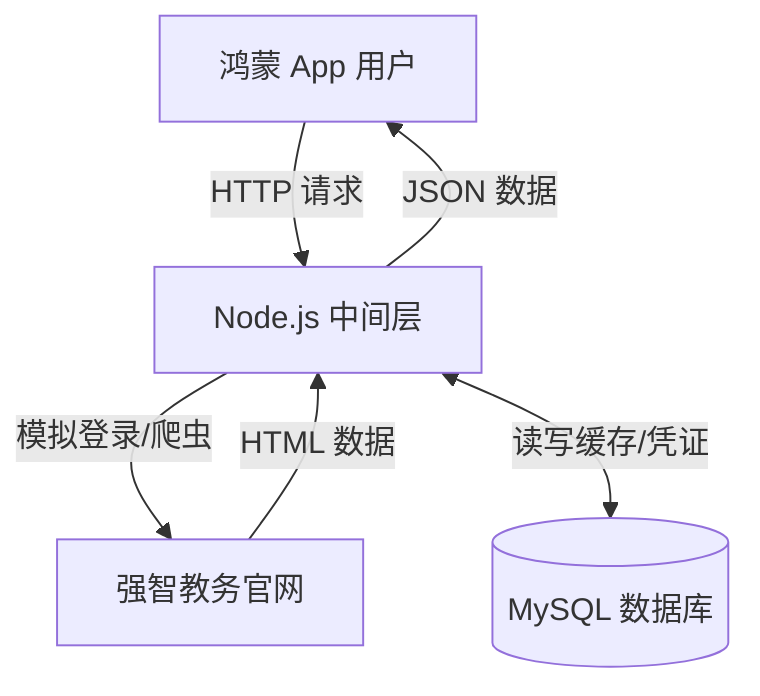

# 鸿蒙原生校园助手开发规划书 (针对强智教务系统)

## 1. 项目概述与架构设计

### 1.1 项目目标
开发一款基于 HarmonyOS (ArkTS) 的原生应用，通过 Node.js 中间层服务器代理访问强智教务系统，实现课程表查询、成绩查询、考试安排查看，并支持数据缓存、自动登录与消息推送。

### 1.2 技术栈选择
*   **前端 (App):** HarmonyOS (API 9+ / API 11+), ArkTS, ArkUI, HTTP Network Kit.
*   **后端 (Server):** Node.js (Express 或 Koa), Axios (用于转发请求), Cheerio (用于解析 HTML), node-schedule (定时任务).
*   **数据库 (Database):** MySQL (推荐) 或 MongoDB. 用于存储用户信息(加密)、Cookie/Token、以及缓存的教务数据.
*   **工具:** Postman (接口测试), Git (版本控制).

### 1.3 系统架构图


---

## 2. 数据库设计 (MySQL 示例)

我们需要存储用户的登录凭证（用于自动维持会话）和业务数据（用于离线查看和对比变动）。

### 2.1 用户表 (`users`)
用于存储学生账号信息。**注意：** 由于需要后端自动登录教务系统，通常需要存储密码。**必须使用高强度加密（如 AES）存储密码，绝不能明文存储。**

| 字段名 | 类型 | 说明 |
| :--- | :--- | :--- |
| `id` | INT (PK) | 自增主键 |
| `student_id` | VARCHAR | 学号 (唯一索引) |
| `password_encrypted`| VARCHAR | 加密后的教务系统密码 |
| `cookies` | TEXT | 序列化后的 Cookie (JSESSIONID 等) |
| `last_login_time` | DATETIME | 最后一次成功登录时间 |
| `push_token` | VARCHAR | 鸿蒙 Push Kit 的 Token (用于推送) |

### 2.2 课程表缓存 (`courses`)
| 字段名 | 类型 | 说明 |
| :--- | :--- | :--- |
| `id` | INT (PK) | 自增主键 |
| `student_id` | VARCHAR | 关联学号 |
| `course_name` | VARCHAR | 课程名称 |
| `teacher` | VARCHAR | 教师 |
| `location` | VARCHAR | 教室 |
| `weeks` | VARCHAR | 上课周次 (如 "1-16") |
| `day_of_week` | INT | 星期几 (1-7) |
| `section` | VARCHAR | 节次 (如 "1-2") |
| `semester` | VARCHAR | 学期 (如 "2025-2026-1") |

### 2.3 成绩表缓存 (`grades`)
| 字段名 | 类型 | 说明 |
| :--- | :--- | :--- |
| `id` | INT (PK) | 自增主键 |
| `student_id` | VARCHAR | 关联学号 |
| `course_name` | VARCHAR | 课程名称 |
| `score` | VARCHAR | 成绩 |
| `credit` | FLOAT | 学分 |
| `semester` | VARCHAR | 学期 |

---

## 3. 后端开发规划 (Node.js)

后端的核心是**模拟浏览器行为**。强智系统通常依赖 Cookie (`JSESSIONID`) 维持会话。

### 3.1 核心模块功能
1.  **登录模块 (Login Service):**
    *   接收前端传来的学号/密码。
    *   请求教务系统登录页，获取初始 Cookie 和可能的隐藏字段 (ViewState)。
    *   如果是强智系统，可能涉及验证码。
        *   *方案 A (简单):* 使用 OCR 库 (如 `tesseract.js`) 识别。
        *   *方案 B (稳定):* 将验证码图片 Base64 返回给前端，用户手动输入。
    *   发送 POST 请求进行登录。
    *   登录成功后，将 Cookie 和加密后的密码存入数据库。

2.  **数据获取模块 (Scraper Service):**
    *   使用存储的 Cookie 访问“课表页面”、“成绩页面”的 URL。
    *   使用 `Cheerio` 解析返回的 HTML 表格。
    *   将解析后的数据清洗为 JSON 格式。
    *   **对比逻辑:** 将新抓取的数据与数据库中的旧数据对比。如果成绩有新增，触发推送逻辑。
    *   更新数据库缓存。

3.  **会话维持 (Session Keep-alive):**
    *   强智系统通常 30 分钟无操作会踢出。
    *   **策略:** 在用户每次请求 API 时，先检查 Cookie 是否有效（尝试访问一个简单页面）。如果失效，利用数据库中加密的密码重新执行一次“登录模块”的逻辑，获取新 Cookie，再执行当前请求。

### 3.2 接口设计 (RESTful API)

*   `POST /api/auth/login`: 登录，返回 JWT Token 给前端。
*   `GET /api/course/schedule`: 获取课表 (优先读库，可强制刷新)。
*   `GET /api/score/all`: 获取成绩。
*   `POST /api/user/bind`: 绑定鸿蒙推送 Token。

---

## 4. 前端开发规划 (HarmonyOS ArkTS)

### 4.1 UI 结构设计
采用 `Tabs` 组件作为主框架：
1.  **首页 (Home):** 展示今日课表 (使用 `List` 或 `Grid` 布局)、快捷入口。
2.  **查询 (Query):** 成绩查询、考试安排、空教室查询。
3.  **我的 (Profile):** 个人信息、设置、关于页面、注销。

### 4.2 关键技术点

#### A. 网络请求封装 (Axios 或 http 模块)
创建一个 `HttpUtils` 类，统一管理请求。
```typescript
// 伪代码示例
import http from '@ohos.net.http';

export class Request {
  static async post(url: string, data: any) {
    let httpRequest = http.createHttp();
    let response = await httpRequest.request(url, {
      method: http.RequestMethod.POST,
      extraData: data,
      header: { 'Content-Type': 'application/json' }
    });
    // 处理结果，比如统一处理 Token 过期
    return JSON.parse(response.result as string);
  }
}
```

#### B. 数据持久化 (Preferences)
使用 `user_preferences` 存储简单的配置，如：
*   `is_logged_in`: boolean
*   `app_token`: string (后端颁发的 JWT)
*   `current_week`: number (当前周次)

#### C. 自动登录逻辑
1.  **首次登录:** 用户输入学号密码 -> 调用后端 `/login` -> 后端爬虫登录成功 -> 返回 Token。
2.  **App 启动:** 检查本地 Preferences 是否有 Token。
    *   *有:* 直接进入主页，静默请求 `/api/course/schedule` 更新数据。
    *   *无:* 跳转登录页。
3.  **Token 失效:** 如果后端返回 401，前端自动跳转登录页或弹出“登录过期”提示。

---

## 5. 业务绑定与前后端互通流程

### 场景一：用户首次登录
1.  **前端:** 用户在 ArkTS 界面输入学号、密码，点击登录。
2.  **前端:** 请求 `POST /api/auth/login`。
3.  **后端:** 接收请求，启动 Puppeteer 或 Axios 请求强智教务系统登录页。
4.  **后端:** 拿到 Cookie，存入 MySQL `users` 表。
5.  **后端:** 生成一个 App 专用的 JWT Token，返回给前端。
6.  **前端:** 将 JWT 存入 Preferences，跳转主页。

### 场景二：查询课表 (带缓存策略)
1.  **前端:** 调用 `GET /api/course/schedule`。
2.  **后端:**
    *   **Step 1:** 检查 MySQL `courses` 表是否有该学生本学期数据。
    *   **Step 2 (有数据):** 直接返回数据库 JSON (速度快)。
    *   **Step 3 (无数据或强制刷新):** 读取 `users` 表中的 Cookie，访问教务系统课表 URL。
    *   **Step 4 (Cookie 失效):** 如果教务系统返回“请登录”，后端自动利用加密密码重新模拟登录，更新 Cookie，再次抓取。
    *   **Step 5:** 解析 HTML，存入 MySQL，返回 JSON 给前端。

### 场景三：消息推送 (成绩更新)
1.  **后端:** 开启 `node-schedule` 定时任务 (例如每 2 小时)。
2.  **后端:** 遍历 `users` 表，利用存储的凭证模拟请求成绩页面。
3.  **后端:** 解析最新成绩，与 `grades` 表对比。
4.  **后端:** 发现新条目 -> 调用华为 Push Kit 服务端接口 -> 推送消息到鸿蒙手机。
5.  **前端:** 收到通知栏消息，点击跳转到成绩详情页。

---

## 6. 开发步骤建议 (Roadmap)

### 第一阶段：原型与基础 (Week 1-2)
1.  **后端:** 搭建 Node.js 环境，写一个简单的脚本，使用 `axios` + `cheerio` 成功在控制台打印出你的课表数据 (先不连数据库，硬编码 Cookie 测试)。
2.  **前端:** 搭建 HarmonyOS 项目，画出登录页和主页 UI。

### 第二阶段：数据联调 (Week 3-4)
1.  **后端:** 引入 MySQL，设计 User 和 Course 表。实现登录接口和课表接口。
2.  **前端:** 实现网络请求模块，打通登录和课表显示。

### 第三阶段：高级功能 (Week 5-6)
1.  **后端:** 实现“Cookie 自动保活/重登”逻辑。添加成绩抓取逻辑。
2.  **前端:** 完善成绩展示页面，优化 UI 细节 (加载动画、错误提示)。

### 第四阶段：推送与发布 (Week 7)
1.  **后端:** 对接华为 Push Kit。
2.  **测试:** 模拟密码错误、教务系统崩溃等异常情况。

---

## 7. 给新手的特别提示

1.  **强智系统坑点:** 强智系统有的学校是内网访问，如果你在公网部署 Node.js 服务器，可能连不上学校教务。
    *   *解决方案:* 购买学校内网 VPN，或者将 Node.js 部署在能访问校内网的服务器上。如果只是练手，可以在自己电脑运行 Node.js，手机和电脑连同一 WiFi 调试。
2.  **ArkTS 学习:** 重点关注 `@State`, `@Link`, `@Prop` 装饰器，这是鸿蒙 UI 状态管理的核心。
3.  **法律风险:** 爬虫请务必遵守 `robots.txt` (虽然教务系统一般没有)，且**严禁**将学生数据用于商业出售。仅作为工具类应用使用。
